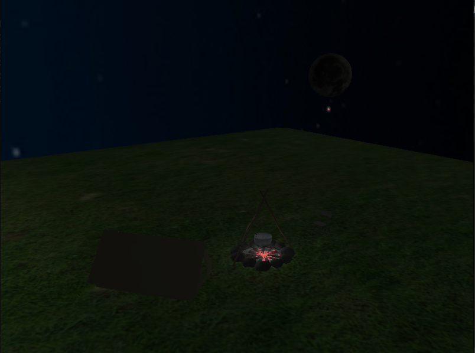

# Campsite

# Photo

 
# Keyboard instructions:

Moving: 
`W` - forwards

`S` - backwards

`A` - left

`D` - right

 
Ambient manipulation:
 

`B` - turn on/off bloom

# Implemented techniques

- Required:
    - [x] [Blending, discard]
    - [x] [Face culling]
    - [x] [Advanced lighting]
- Group A:
    - [x] [Cubemaps - skybox]
- Group B:
    - [x] [Bloom] [HDR]